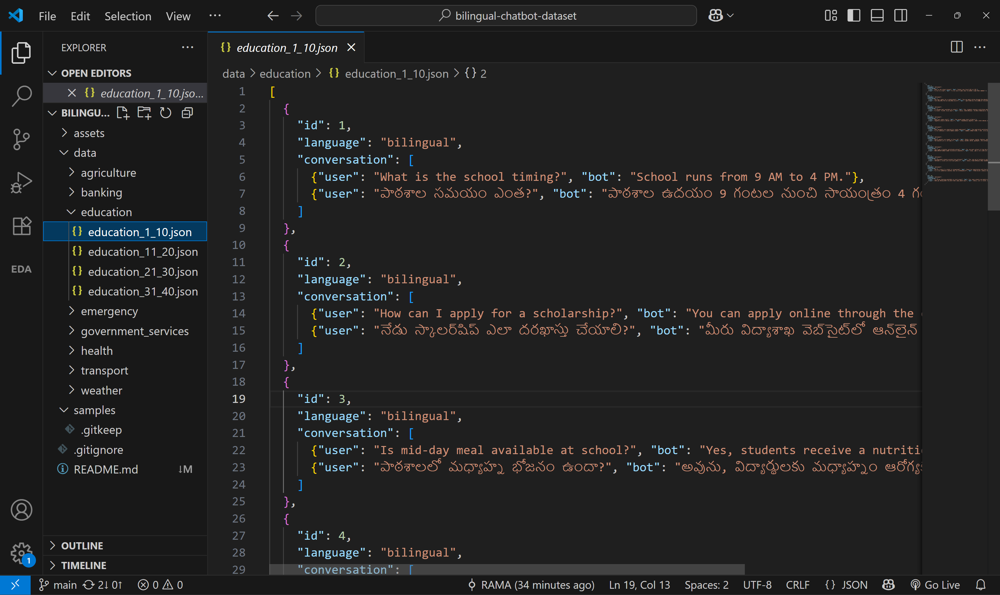

# 🧠 Bilingual Chatbot Dataset – Telugu & English (2025)

A handcrafted dataset of realistic chatbot conversations in **Telugu and English** across multiple domains to help train, fine-tune, and evaluate multilingual AI assistants.

## 📂 Project Structure
```
bilingual-chatbot-dataset/
├── data/
│   ├── education/
│   ├── health/
│   ├── weather/
│   ├── agriculture/
│   ├── government_services/
│   ├── transport/
│   ├── banking/
│   └── emergency/
├── samples/
└── assets/

```


## 🔥 Highlights

- 🎯 Focused on **realistic conversations** with cultural and linguistic accuracy.
- 🗣️ Supports **both Telugu and English** side-by-side.
- 📚 Covers **30–40 samples per domain**, increasing in complexity and length.
- ✅ Useful for both **chatbot evaluation** and **fine-tuning**.

---

## 🧾 Domains Covered

| Domain               | Description                                    |
|----------------------|------------------------------------------------|
| Education            | School queries, admission, exam schedules     |
| Health               | Illness symptoms, doctor visits, suggestions  |
| Weather              | Daily/weekly forecast, climate updates        |
| Agriculture          | Crop advice, pests, irrigation, market rates  |
| Government Services  | Ration, ID proof, complaints, benefits        |
| Transport            | Buses, trains, auto fares, timings            |
| Banking              | ATM help, balance inquiry, mobile banking     |
| Emergency            | Medical, police, fire, disaster response      |

---

## 🧱 JSON Formats Supported

To ensure flexibility for different chatbot training needs, the dataset uses **two JSON formats**:

### 🅰️ Format 1: Simple Bilingual QA

```json
{
  "id": 1,
  "language": "bilingual",
  "conversation": [
    { "user": "What is the school timing?", "bot": "School runs from 9 AM to 4 PM." },
    { "user": "పాఠశాల సమయం ఎంత?", "bot": "పాఠశాల ఉదయం 9 గంటల నుంచి సాయంత్రం 4 గంటల వరకు ఉంటుంది." }
  ]
}
```
✅ Best for simple QA or intent classification.

🅱️ Format 2: Multi-turn Chat with Speaker Labels
```
{
  "id": "health_001",
  "language": "en-te",
  "conversation": [
    { "speaker": "user", "en": "I have a fever.", "te": "నాకు జ్వరం వచ్చింది." },
    { "speaker": "bot", "en": "Since when are you experiencing fever?", "te": "ఎప్పటి నుంచి జ్వరం ఉందని అనుభవిస్తున్నారు?" },
    { "speaker": "user", "en": "Since last night.", "te": "నిన్న రాత్రి నుంచి." },
    { "speaker": "bot", "en": "You should rest and drink plenty of fluids.", "te": "మీరు విశ్రాంతి తీసుకొని ఎక్కువగా ద్రవాలు త్రాగాలి." }
  ]
}
```
✅ Best for multi-turn dialogue systems and speaker-aware models.

🌐 Explore Folders
/data/education – 40 conversations

/data/health – 40 conversations

/data/weather – 40 conversations

More coming soon: agriculture, banking, emergency...

🖼️ Dataset Preview




📌 Goals
Build bilingual AI assistants capable of handling rural and semi-urban Indian scenarios.

Promote open-source Telugu NLP with culturally sensitive, realistic data.

Assist researchers, startups, and educators working on inclusive AI systems.

🔗 GitHub
📁 Repo: bilingual-chatbot-dataset

✍️ Contribution
We welcome suggestions and PRs to improve coverage, diversity, and format compatibility. Please ensure:

Translations are accurate and culturally relevant.

Tone is friendly and helpful (suitable for AI assistants).

📜 License
This dataset is released under the MIT License — free to use, share, and build upon with attribution.


